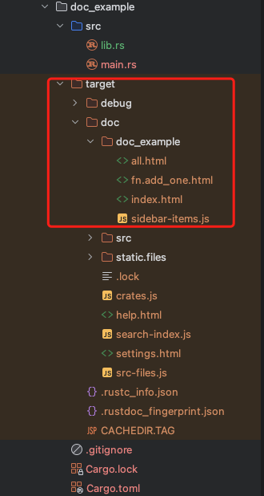
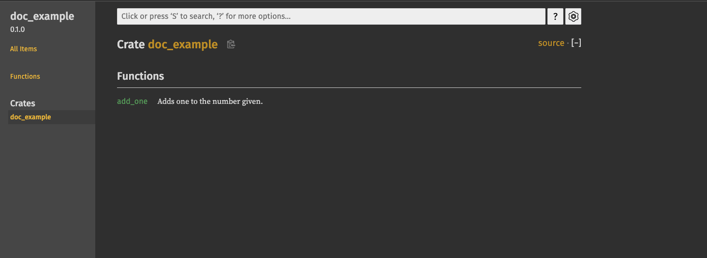
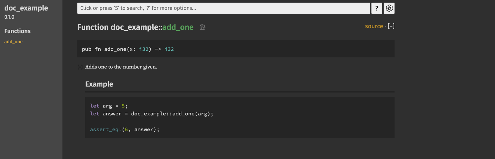
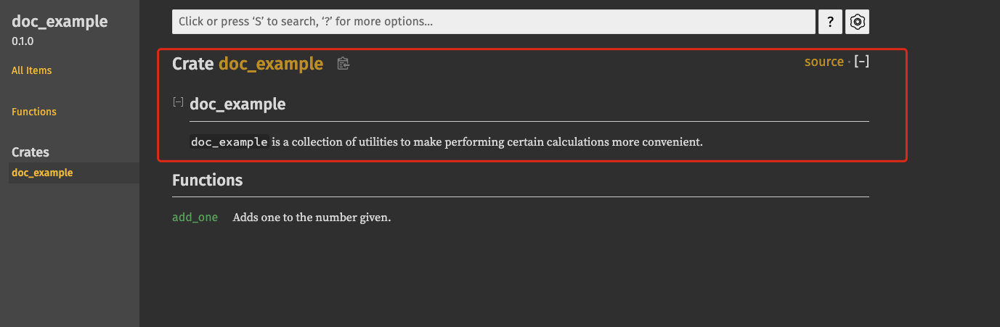

# PART1. crates.io

- 可以通过发布包来共享你的代码
- [crate的注册表地址](https://crates.io/)
  - 它会分发已注册的包的源代码
  - 主要托管开源的代码

# PART2. 文档注释

文档注释:用于生成文档

- 生成HTML格式的文档
- 用于显示公共API的文档注释: 告知阅读者如何使用你的API
- 使用`///`编写文档注释
- 文档注释支持Markdown语法
- 放置在被说明的语法项之前

```rust
/// Adds one to the number given.
/// # Example
///
/// ```
/// let arg = 5;
/// let answer = doc_example::add_one(arg);
///
/// assert_eq!(6, answer);
/// ```
pub fn add_one(x: i32) -> i32 {
    x + 1
}
```

使用`cargo doc`命令生成文档

```
cargo doc
 Documenting doc_example v0.1.0 (/doc_example)
    Finished `dev` profile [unoptimized + debuginfo] target(s) in 0.99s
   Generated /doc_example/target/doc/doc_example/index.html
```

# PART2. 生成HTML文档的命令

- `cargo doc`
  - 该命令会运行`rustdoc`工具(Rust安装包自带)
  - 生成的文档放在`target/doc`目录下



通常不会手动打开生成的文档,而是通过`cargo doc --open`命令打开.该命令表示生成文档后自动打开浏览器显示文档

```
--open
    Finished `dev` profile [unoptimized + debuginfo] target(s) in 0.00s
     Opening /doc_example/target/doc/doc_example/index.html
```





# PART3. 常用章节

所谓章节,就是文档中的一个部分.在文档中,章节是由`#`号来表示的.在刚刚的示例中,`# Example`就是一个章节

常用章节:

- `# Panics`: 描述函数可能发生panic的场景
- `# Errors`: 描述函数可能返回的错误.若函数返回`Result`,则通常会有这个章节.该章节用于表述可能返回的错误种类,以及可导致错误的条件
- `# Safety`: 描述函数的安全性.若函数使用了`unsafe`代码,则通常会有这个章节.该章节用于描述函数的安全性,以及使用函数时需要注意的事项.换言之,如果函数处于unsafe调用,就需要解释函数unsafe的原因,以及调用者确保的使用前提

# PART4. 文档注释作为测试

文档注释可以作为测试用例.在刚刚的例子中,有一段代码块,用于测试`add_one`函数.这段代码块会被`cargo test`命令执行

```
cargo test
   Compiling doc_example v0.1.0 (/doc_example)
    Finished `test` profile [unoptimized + debuginfo] target(s) in 5.47s
     Running unittests src/lib.rs (target/debug/deps/doc_example-2594a47c99595487)

running 0 tests

test result: ok. 0 passed; 0 failed; 0 ignored; 0 measured; 0 filtered out; finished in 0.00s

     Running unittests src/main.rs (target/debug/deps/doc_example-d6a05f5b815c0cf9)

running 0 tests

test result: ok. 0 passed; 0 failed; 0 ignored; 0 measured; 0 filtered out; finished in 0.00s

   Doc-tests doc_example

running 1 test
test src/lib.rs - add_one (line 4) ... ok

test result: ok. 1 passed; 0 failed; 0 ignored; 0 measured; 0 filtered out; finished in 0.48s
```

可以看到`Doc-tests`部分,有1个测试通过了.这个测试就是文档注释中的测试用例

# PART5. 为包含注释的项添加文档注释

- `//!`:用于给模块添加文档注释
  - 通常放在模块的开头
  - 用于给包裹当前注释的外层语法项添加文档注释
  - 注意:该符号不是给紧随该符号后的语法项添加注释,而是给包裹该符号的外层语法项添加注释

- 这类注释通常用于描述crate和模块:
  - crate root(按惯例即为`src/lib.rs`)
  - 一个模块内,将crate或模块作为一个整体进行记录

例:

```rust
//! # doc_example
//!
//! `doc_example` is a collection of utilities to make performing certain
//! calculations more convenient.

/// Adds one to the number given.
/// # Example
///
/// ```
/// let arg = 5;
/// let answer = doc_example::add_one(arg);
///
/// assert_eq!(6, answer);
/// ```
pub fn add_one(x: i32) -> i32 {
    x + 1
}
```

```
cargo doc --open
 Documenting doc_example v0.1.0 (/doc_example)
    Finished `dev` profile [unoptimized + debuginfo] target(s) in 1.06s
     Opening /doc_example/target/doc/doc_example/index.html
```

