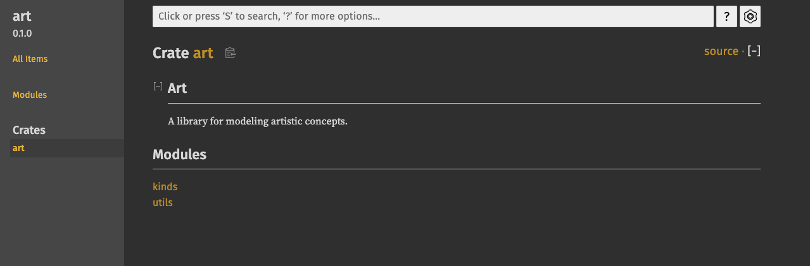
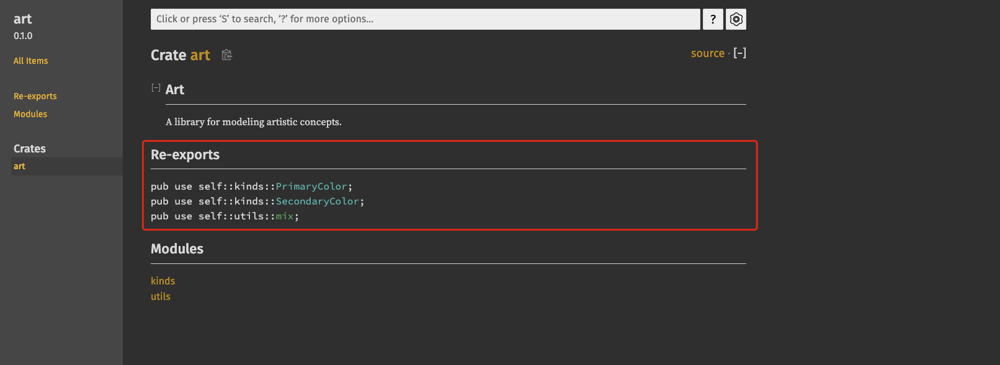

# PART1. 使用pub use导出方便使用的公共API

问题: crate的代码组织结构,在开发时对于开发者是很合理的,但对于它的使用者却不够方便

- 开发者通常会把代码结构分为很多层,而使用者想要找到这种深层结构中的某个类型就比较费劲了

例:

- 在开发时有这样一个类型:`my_crate::some_module::another_module::UsefulType`
- 而使用者期望的是`my_crate::UsefulType`

解决办法:

- 不需要重新组织内部的代码结构
- 使用`pub use`:可以重新导出,创建一个与内部私有结构不同的对外公共结构

重新导出会取得某个位置上的公共语法项(就是被pub关键字修饰的语法项),并将该语法项重新公开到另外一个位置.就好像这个语法项原本就是定义在新的位置上一样.

例:现有一项目如下

```
tree ./
./
├── Cargo.lock
├── Cargo.toml
└── src
    ├── lib.rs
    └── main.rs

1 directory, 4 files
```

`src/lib.rs`:

```rust
//! # Art
//!
//! A library for modeling artistic concepts.

pub mod kinds {
    /// The primary colors according to the RYB color model.
    pub enum PrimaryColor {
        Red,
        Yellow,
        Blue
    }

    /// The secondary colors according to the RYB color model.
    pub enum SecondaryColor {
        Orange,
        Green,
        Purple
    }
}

pub mod utils {
    use crate::kinds::*;

    /// Combines two primary colors in equal amounts to create
    /// a secondary color.
    pub fn mix(c1: PrimaryColor, c2: PrimaryColor) -> SecondaryColor {
        SecondaryColor::Green
    }
}
```

`src/main.rs`:

```rust
use art::kinds::PrimaryColor;
use art::utils::mix;

fn main() {
    let red = PrimaryColor::Red;
    let yellow = PrimaryColor::Yellow;
    mix(red, yellow);
}
```

注意现在`main.rs`中引入这些枚举和函数时的写法,层次比较深,但这对于调用库的用户来说,并没有什么意义.

```
cargo doc --open
 Documenting art v0.1.0 (/art)
    Finished `dev` profile [unoptimized + debuginfo] target(s) in 2.18s
     Opening /art/target/doc/art/index.html
```



从文档中也能发现,需要点到kinds和utils这2个模块中,才能看到其中定义的枚举和函数

使用`pub use`把公共语法项重新导出到顶层结构中:

在这个例子中,枚举和函数的顶层结构就是crate root了:

`src/lib.rs`:

```rust
//! # Art
//!
//! A library for modeling artistic concepts.

pub use self::kinds::PrimaryColor;
pub use self::kinds::SecondaryColor;
pub use self::utils::mix;

pub mod kinds {
    /// The primary colors according to the RYB color model.
    pub enum PrimaryColor {
        Red,
        Yellow,
        Blue
    }

    /// The secondary colors according to the RYB color model.
    pub enum SecondaryColor {
        Orange,
        Green,
        Purple
    }
}

pub mod utils {
    use crate::kinds::*;

    /// Combines two primary colors in equal amounts to create
    /// a secondary color.
    pub fn mix(c1: PrimaryColor, c2: PrimaryColor) -> SecondaryColor {
        SecondaryColor::Green
    }
}
```

这样,在`main.rs`中的导入就可以简化为:

```rust
use art::PrimaryColor;
use art::mix;

fn main() {
    let red = PrimaryColor::Red;
    let yellow = PrimaryColor::Yellow;
    mix(red, yellow);
}
```

再次生成文档:

```
cargo doc --open
 Documenting art v0.1.0 (/art)
    Finished `dev` profile [unoptimized + debuginfo] target(s) in 1.09s
     Opening /art/target/doc/art/index.html
```

