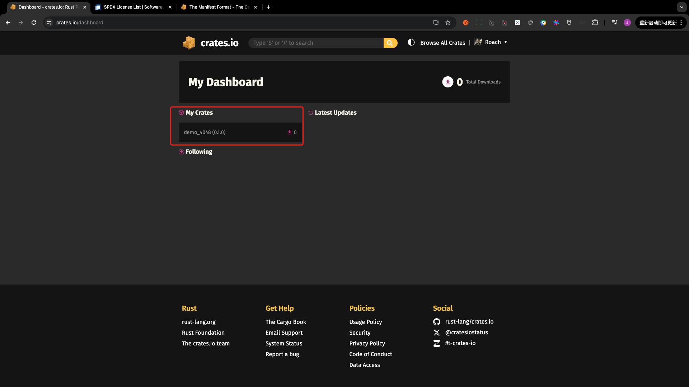

# PART1. 创建并设置crates.io账号

发布crate前,需要在crates.io上创建账号并获得API token


```
cargo login 你的token
       Login token for `crates-io` saved
```

该命令会将token存储在本地的`~/.cargo/credentials.toml`文件中

```
cat ~/.cargo/credentials.toml 
[registry]
token = "你的token"
```

# PART2. 创建并发布crate

在发布crate之前,需要在`Cargo.toml`的`[package]`部分添加一些元数据:

- name: crate需要的唯一的名称
- description: crate的简短描述
- license: crate的许可证标识值.可在[此处](https://spdx.org/licenses/)查找
  - 可指定多个license,使用`OR`隔开即可
- version: crate的版本号
- authors: crate的作者列表

其他更多键值对的语义可参考[此处](https://doc.rust-lang.org/cargo/reference/manifest.html)

发布命令:`cargo publish`

注意:

1. 发布只能在所有文件都被提交到git仓库后发布.或者使用`--allow-dirty`参数允许发布未提交的文件.这里我使用提交后发布的方式演示发布.
2. 只有邮箱通过验证的用户才能发布crate

```toml
[package]
name = "demo_4048"
version = "0.1.0"
edition = "2021"
description = "A demo project for Rust."
license = "MIT OR Apache-2.0"

[dependencies]
```

```
cargo publish
    Updating crates.io index
warning: manifest has no documentation, homepage or repository.
See https://doc.rust-lang.org/cargo/reference/manifest.html#package-metadata for more info.
   Packaging demo_4048 v0.1.0 (/demo_4048)
   Verifying demo_4048 v0.1.0 (/demo_4048)
   Compiling demo_4048 v0.1.0 (/demo_4048/target/package/demo_4048-0.1.0)
    Finished `dev` profile [unoptimized + debuginfo] target(s) in 7.34s
    Packaged 6 files, 1.0KiB (839.0B compressed)
   Uploading demo_4048 v0.1.0 (/demo_4048)
    Uploaded demo_4048 v0.1.0 to registry `crates-io`
note: waiting for `demo_4048 v0.1.0` to be available at registry `crates-io`.
You may press ctrl-c to skip waiting; the crate should be available shortly.
   Published demo_4048 v0.1.0 at registry `crates-io`
```



- crate一旦发布,就是永久性的:该版本无法覆盖,代码无法删除
  - 目的: 确保依赖于该版本的项目可以继续正常工作

# PART3. 发布已存在的crate的新版本

修改代码后,需要先修改`Cargo.toml`中的`version`字段,然后再发布

可参照[此处](https://semver.org/)来使用语义化版本号

再执行`cargo publish`进行发布

```toml
[package]
name = "demo_4048"
version = "0.2.0"
edition = "2021"
description = "A demo project for Rust. New version."
license = "MIT OR Apache-2.0"

[dependencies]
```

```
cargo publish
    Updating crates.io index
warning: manifest has no documentation, homepage or repository.
See https://doc.rust-lang.org/cargo/reference/manifest.html#package-metadata for more info.
   Packaging demo_4048 v0.2.0 (/demo_4048)
   Verifying demo_4048 v0.2.0 (/demo_4048)
   Compiling demo_4048 v0.2.0 (/demo_4048/target/package/demo_4048-0.2.0)
    Finished `dev` profile [unoptimized + debuginfo] target(s) in 3.26s
    Packaged 6 files, 1.1KiB (842.0B compressed)
   Uploading demo_4048 v0.2.0 (/demo_4048)
    Uploaded demo_4048 v0.2.0 to registry `crates-io`
note: waiting for `demo_4048 v0.2.0` to be available at registry `crates-io`.
You may press ctrl-c to skip waiting; the crate should be available shortly.
   Published demo_4048 v0.2.0 at registry `crates-io`
```


# PART4. 使用`cargo yank`从crates.io撤回版本

- 不可以删除已发布的crate,但可以撤回某个版本
- 撤回的目的:
  - 防止其他项目把新版本作为依赖
  - 已经依赖了该版本的项目仍然可以继续使用该版本
- yank的含义:
  - 所有已经产生了`Cargo.lock`的项目都不会中断
  - 任何将来生成的`Cargo.lock`文件都不会使用被yank的版本
- 命令: `cargo yank --vers 要撤回的版本号`

例:

```
cargo yank --vers 0.2.0
    Updating crates.io index
        Yank demo_4048@0.2.0
```


# PART5. 取消撤回

- 撤回的版本可以再次发布
- 命令:`cargo yank --vers 要取消撤回的版本号 --undo`

例:

```
cargo yank --vers 0.2.0 --undo
    Updating crates.io index
      Unyank demo_4048@0.2.0
```

