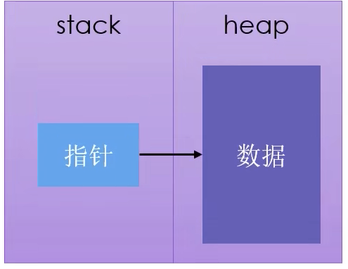
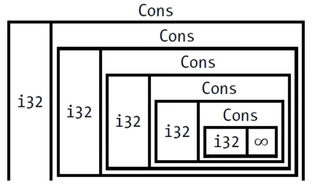
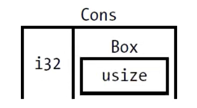

# PART1. `Box<T>`

`Box<T>`是最简单的智能指针:



- 允许你在heap上存储数据(而非stack上)
  - 这里的允许,是指允许你将一个本该存储在stack上的数据,存储在heap上.例如一个i32类型的数据
- 具体的实现方式为:
  - `Box<T>`在stack上有一小块内存,这一小块内存用于存储一个指针
  - 该指针指向heap上的数据
  - 也就是说数据还是存储在heap上的,只是这个指针存储在stack上
- 除了把数据存在了heap上之外,`Box<T>`没有其他的性能损失
  - 也就是说,`Box<T>`和直接在stack上存储数据的性能是一样的
- 同时,`Box<T>`也并没有其他额外的功能
- 之所以`Box<T>`是智能指针,是因为:
  - 它实现了`Deref` trait: 该trait允许`Box<T>`实例表现的像引用一样
  - 它实现了`Drop` trait: 该trait允许`Box<T>`实例在离开作用域时释放其内存
  
这里所谓的`Box<T>`实例表现的像引用一样,是指`Box<T>`实例可以被解引用,并且可以像引用一样被使用:

```rust
fn main() {
    let x = 5;
    let y = Box::new(5);

    // 使用解引用操作符获取Box指向的数据
    // 对Box<T>类型的值使用解引用操作符*会得到一个T类型
    assert_eq!(x, *y);

    let w = &6;
    let y = Box::new(6);
    // assert_eq!宏在比较2个引用时,比较的是引用的值是否相等
    // 这里不能直接拿w和y比较,因为虽然它们都是指向6的引用,但w的类型为&i32,y的类型为Box<i32>
    // 所以需要先解引用y,再和w比较(实际上这里最后取y的引用只是为了让y和w的类型一致)
    assert_eq!(w, &(*y));
}
```

```
cargo run
   Compiling box_as_reference v0.1.0 (/box_as_reference)
    Finished `dev` profile [unoptimized + debuginfo] target(s) in 0.20s
     Running `target/debug/box_as_reference`
```

`Box<T>`是一个只有一个字段的结构体,这个字段是一个指向heap上的T类型数据的指针

# PART2. `Box<T>`的使用场景

- 在编译时,某个类型的大小无法确定,但使用该类型时,上下文却需要知道它的确切大小时,可以使用`Box<T>`
  - 注意这里说的是**类型的大小**,而不是**该类型的值的大小**
- 当你有大量数据需要移交所有权,但又不想每次移交所有权的操作都进行一次深拷贝时,可以使用`Box<T>`
  - 例如,你有一个函数需要返回一个大的结构体,但你又不想每次返回这个结构体时都进行一次深拷贝
- 使用某个值时,你只关心它是否实现了特定的trait,而不关心它的具体类型时,可以使用`Box<T>`
  - 例如,你有一个函数需要接受一个实现了`Write` trait的值,但你不关心这个值的具体类型是什么

# PART3. `Box<T>`如何在heap上存储数据

```rust
fn main() {
  // 如果使用其他整型存储这个5 那么该值将会被存储在stack上
  // 但是使用Box存储这个5 那么该值将会被存储在heap上
  let b = Box::new(5);
  println!("b = {}", b);
} // 和其他任何拥有所有权的类型一样,当Box离开作用域时,它的值将会被释放.这里释放Box,释放的是它存储在stack上的指针,以及它存储在heap上的值
```

```
cargo run
   Compiling box_example v0.1.0 (/box_example)
    Finished `dev` profile [unoptimized + debuginfo] target(s) in 0.80s
     Running `target/debug/box_example`
b = 5
```

# PART4. 使用`Box<T>`赋能递归类型

- 在编译时,Rust需要知道每一个类型所占的空间大小
- 而递归类型无法在编译时确定大小



如上图示,`Cons`类型有2个字段:

- i32类型的字段,表示当前节点的值
- `Cons`类型的字段,表示下一个节点
- 可以认为`Cons`类型是链表上的一个节点
- 这种数据类型在函数式语言中叫做Cons List

在编译时,Rust就需要知道这个类型的大小.但由于这个类型是递归的,所以无法在编译时确定大小.

确切的说,是无法确定`Cons`类型中的第二个字段的大小,因为这个字段是`Cons`类型的一个实例

这里就需要使用`Box<T>`来解决这个问题:因为针对递归类型,`Box<T>`可以确定其大小.

`Box<T>`类型在stack上只存储了一个指针,因此无论其在heap上存储的数据有多大,在stack上的大小都是固定的,就是1个指针的大小(usize)

# PART5. Cons List

- Cons List是来自Lisp语言的一种数据结构
- Cons List中,每个成员由2个元素组成(或者也可以说每个节点由2个成员属性构成)
  - 当前项的值
  - 下一个元素
- Cons List中,最后一个成员的下一个元素为Nil,表示没有下一个元素
  - 这里的Nil相当于是一个终止的标记
  - 它和`Option`枚举中的`None`变体的语义是不同的
  - `None`变体的语义表示某个值无效或缺失,而Nil表示链表的终止

# PART5. Cons List并不是Rust中常用的集合

- 通常情况下,在Rust中,使用`Vec<T>`表示集合

尝试在Rust中创建一个Cons List:

这里我们先看不使用`Box<T>`会发生什么:

```rust
#[derive(Debug)]
enum Cons {
    Cons(i32, Cons),
    Nil,
}

fn main() {
    let c = Cons::Cons(1, Cons::Cons(2, Cons::Cons(3, Cons::Nil)));
    println!("{:?}", c);
}
```

```
cargo run
   Compiling cons_list v0.1.0 (/cons_list)
error[E0072]: recursive type `Cons` has infinite size
 --> src/main.rs:2:1
  |
2 | enum Cons {
  | ^^^^^^^^^
3 |     Cons(i32, Cons),
  |               ---- recursive without indirection
  |
help: insert some indirection (e.g., a `Box`, `Rc`, or `&`) to break the cycle
  |
3 |     Cons(i32, Box<Cons>),
  |               ++++    +

error[E0391]: cycle detected when computing when `Cons` needs drop
 --> src/main.rs:2:1
  |
2 | enum Cons {
  | ^^^^^^^^^
  |
  = note: ...which immediately requires computing when `Cons` needs drop again
  = note: cycle used when computing whether `Cons` needs drop
  = note: see https://rustc-dev-guide.rust-lang.org/overview.html#queries and https://rustc-dev-guide.rust-lang.org/query.html for more information

Some errors have detailed explanations: E0072, E0391.
For more information about an error, try `rustc --explain E0072`.
error: could not compile `cons_list` (bin "cons_list") due to 2 previous errors
```

- error[E0072]: recursive type `Cons` has infinite size: 递归类型`Cons`类型有无限的大小
- help: insert some indirection (e.g., a `Box`, `Rc`, or `&`) to break the cycle: 插入一些间接引用(例如`Box`,`Rc`,或`&`)来打破循环
  - 所谓间接,就表示我们应该改变一下这个数据结构
  - 不再直接存储这个数据本身
  - 而是存储一个指针,让该指针指向这个数据
  - 因为指针的大小是确定的,所以这样就可以解决递归类型无法确定大小的问题

那么Rust是如何计算一个非递归类型的大小的呢?

例: Rust如何确定为枚举类型分配的空间大小

```rust
enum Message {
    Quit,
    Move { x: i32, y: i32 },
    Write(String),
    ChangeColor(i32, i32, i32),
}
```

Rust会遍历枚举的每个变体,从而找到最大的变体所占的空间大小,然后将这个大小作为整个枚举类型的大小

这是因为对于枚举类型而言,每一个时刻只能存在1个变体,因此取占用空间最大的变体作为整个枚举类型的大小是合理的

本例中:

- `Quit`变体: 没有任何数据,所以大小为0字节
- `Move`变体: 有2个i32类型的数据,所以大小为8字节
- `Write`变体: 有1个String类型的数据.
  - 在64位系统上,`String`类型的大小为24字节(8字节的指针,8字节的长度,8字节的容量)
  - 也就是`String`类型的元数据的大小
- `ChangeColor`变体: 有3个i32类型的数据,所以大小为12字节

因此,枚举类型`Message`的大小为24字节

```rust
use std::mem;

enum Message {
    Quit,
    Move { x: i32, y: i32 },
    Write(String),
    ChangeColor(i32, i32, i32),
}

fn main() {
    println!("size of Message: {}", mem::size_of::<Message>());
}
```

```
cargo run
   Compiling size_of_enum v0.1.0 (/size_of_enum)
warning: variants `Quit`, `Move`, `Write`, and `ChangeColor` are never constructed
...
warning: `size_of_enum` (bin "size_of_enum") generated 1 warning
    Finished `dev` profile [unoptimized + debuginfo] target(s) in 4.70s
     Running `target/debug/size_of_enum`
size of Message: 24
```

# PART6. 使用`Box<T>`获得确定大小的递归类型

- 因为`Box<T>`是一个指针,所以Rust知道它所需的空间大小
  - 因为指针的大小不会随着指向的数据的大小而变化(指针的大小始终为usize)
  - 也就是说在32位系统上,`Box<T>`的大小为4字节,在64位系统上,`Box<T>`的大小为8字节



```rust
#[derive(Debug)]
enum Cons {
    Cons(i32, Box<Cons>),
    Nil,
}

fn main() {
    let c = Cons::Cons(
        1, Box::new(
            Cons::Cons(
                2, Box::new(
                    Cons::Nil
                )
            )
        )
    );

    println!("{:?}", c)
}
```

```
cargo run
   Compiling cons_list_with_box v0.1.0 (/cons_list_with_box)
warning: fields `0` and `1` are never read
...
warning: `cons_list_with_box` (bin "cons_list_with_box") generated 1 warning
    Finished `dev` profile [unoptimized + debuginfo] target(s) in 0.50s
     Running `target/debug/cons_list_with_box`
Cons(1, Cons(2, Nil))
```

在本例中,`Box<T>`:

- 只提供了"间接"存储和heap内存分配的功能
- 没有其他额外功能
- 没有性能开销
- 适用于需要"间接"存储的场景,例如Cons List
- 实现了`Deref` trait,和`Drop` trait