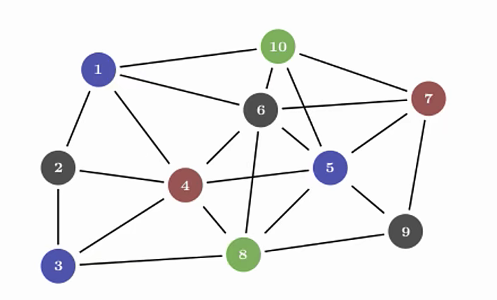
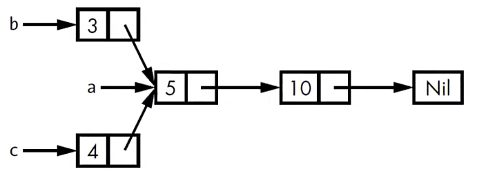

# PART1. `Rc<T>`引用计数智能指针

在大多数情况下,所有权都是比较清晰的.对于一个给定的值,你可以准确地判断出哪个变量拥有它.

但是在某些场景中,单个值也可能被多个变量所持有.例如:



在这种图数据结构中,某个节点有多个边都指向该节点.例如:

6这个节点,它有1、10、7、4、5、8这6个节点指向它.从概念上来讲,6这个节点同时属于所有指向它的边.

而对于1个节点而言,只要有任意一个边还指向它时,它就不应该被清理掉.这就是一种多重所有权的情况.

为了支持多重所有权,Rust提供了`Rc<T>`引用计数智能指针

- RC: reference counting(引用计数)
  - 该类型会在实例内部维护一个记录引用次数的计数器
  - 根据该计数器即可判断该值是否仍然在被使用(也就是追踪到所有指向该值的引用)
  - 当计数器为0时: 说明该值已经没有任何引用,可以被清理掉了.而且这个清理操作不会触发引用失效的问题

# PART2. `Rc<T>`的使用场景

- 需要在heap上分配数据,且这些数据被程序的多个部分读取(注意是只读),但在编译时无法确定哪个部分最后使用完这些数据
  - 反之,如果在编译时能确定是哪个部分最后使用这些数据,那么就不需要使用`Rc<T>`了,直接让这部分代码成为数据的所有者,其他部分通过引用来访问即可
- `Rc<T>`只能用于单线程场景
  - 后续会研究如何在多线程的程序中使用引用计数

# PART3. 例子

- `Rc<T>`不在预导入模块(prelude)中
- `Rc::clone(&a)`: 增加引用计数
- `Rc::strong_count(&a)`: 获取强引用计数
- `Rc::weak_count(&a)`: 获取弱引用计数

需求:



- 现有a、b、c共3个List
- 其中b和c要共享a的所有权

先来尝试使用`Box<T>`:

```rust
enum List {
    Cons(i32, Box<List>),
    Nil,
}

fn main() {
    let a = List::Cons(5, Box::new(List::Cons(10, Box::new(List::Nil))));

    let b = List::Cons(3, Box::new(a));

    // 此处a的所有权已经被转移给b, 因此不能再使用a
    let c = List::Cons(4, Box::new(a));  // error: value used after being moved
}
```

```
cargo run
   Compiling rc_example v0.1.0 (/rc_example)
...
error[E0382]: use of moved value: `a`
  --> src/main.rs:12:36
   |
7  |     let a = List::Cons(5, Box::new(List::Cons(10, Box::new(List::Nil))));
   |         - move occurs because `a` has type `List`, which does not implement the `Copy` trait
8  |
9  |     let b = List::Cons(3, Box::new(a));
   |                                    - value moved here
...
12 |     let c = List::Cons(4, Box::new(a));  // error: value used after being moved
   |                                    ^ value used here after move

For more information about this error, try `rustc --explain E0382`.
warning: `rc_example` (bin "rc_example") generated 2 warnings
error: could not compile `rc_example` (bin "rc_example") due to 1 previous error; 2 warnings emitted
```

这里的修改有2种思路:

## 3.1 思路1: 修改`List`的定义,使其`Cons`变体持有一个`Box<List>`的引用,而不是直接持有`Box<List>`

但是这样就要指定`Box<List>`的生命周期,且要求该List中的所有元素的生命周期至少和List一样长

```rust
#[derive(Debug)]
enum List<'a> {
  Cons(i32, Box<&'a List<'a>>),
  Nil,
}

fn main() {
  // 此处不能写成如下代码:
  // let a = List::Cons(5, Box::new(&List::Cons(10, Box::new(&List::Nil))));
  // 这是因为:
  // &List::Cons(10, Box::new(&List::Nil))是一个临时值,而临时值在表达式结束时就会被释放
  // 因此&List::Cons(10, Box::new(&List::Nil))的生命周期会比a短,这样就会出现悬垂引用
  // 为了解决这个问题,就需要将临时值绑定到一个变量上,使得这些临时值的生命周期延长到与 a b c这3个变量的生命周期相同

  // 这里不需要将&List::Nil绑定到变量上,因为 List::Nil 是一个静态值,它的生命周期是整个程序的生命周期
  // List::Nil 之所以是静态值,是因为它在编译时就确定的常量表达式
  let binding = List::Cons(10, Box::new(&List::Nil));
  let a = List::Cons(5, Box::new(&binding));

  let b = List::Cons(3, Box::new(&a));

  let c = List::Cons(4, Box::new(&a));

  println!("{:?}", b);
  println!("{:?}", c);
}
```

```
cargo run
   Compiling rc_example_1 v0.1.0 (/rc_example_1)
...

warning: `rc_example_1` (bin "rc_example_1") generated 1 warning
    Finished `dev` profile [unoptimized + debuginfo] target(s) in 0.67s
     Running `target/debug/rc_example_1`
Cons(3, Cons(5, Cons(10, Nil)))
Cons(4, Cons(5, Cons(10, Nil)))
```

## 3.2 思路2: 使用`Rc<T>`智能指针

```rust
use std::rc::Rc;

#[derive(Debug)]
enum List {
  Cons(i32, Rc<List>),
  Nil,
}

fn main() {
  // Rc<T> 类型只有当引用计数为0的时候才会被释放
  let a = Rc::new(List::Cons(5, Rc::new(List::Cons(10, Rc::new(List::Nil)))));

  // 此处调用Rc::clone()会使a的引用计数加1 也就是从1变成2
  // 因为Rc::new()的时候引用计数就是1 因为a本身要对这个数据进行引用 所以初态的 let a = Rc::new() 的时候引用计数就是1

  // 此处使用 a.clone() 和 Rc::clone()是等效的
  // 但是注意: 这个等效的前提是a的类型为 Rc<T>
  // 因为其他类型的clone()方法可能是深拷贝 而Rc<T>类型的 Rc<T>.clone()方法 与 Rc<T>::clone()关联函数是等效的

  let b = List::Cons(3, Rc::clone(&a));

  let c = List::Cons(4, Rc::clone(&a));

  println!("{:?}", b);
  println!("{:?}", c);
}
```

```
cargo run
   Compiling rc_example_2 v0.1.0 (/rc_example_2)
...

warning: `rc_example_2` (bin "rc_example_2") generated 1 warning
    Finished `dev` profile [unoptimized + debuginfo] target(s) in 0.63s
     Running `target/debug/rc_example_2`
Cons(3, Cons(5, Cons(10, Nil)))
Cons(4, Cons(5, Cons(10, Nil)))
```

然后我们基于这个例子,来打印一些引用计数的信息:

```rust
use std::rc::Rc;

#[derive(Debug)]
enum List {
    Cons(i32, Rc<List>),
    Nil,
}

fn main() {
    let a = Rc::new(List::Cons(5, Rc::new(List::Cons(10, Rc::new(List::Nil)))));
    // 创建a之后 该数据的强引用计数为1
    println!("count after creating a = {}", Rc::strong_count(&a));

    let _b = List::Cons(3, Rc::clone(&a));
    // 创建b之后 该数据的强引用计数+1(也就是2) 因为b和a都指向了同一个数据
    println!("count after creating b = {}", Rc::strong_count(&a));

    {
        let _c = List::Cons(4, Rc::clone(&a));
        // 创建c之后 该数据的强引用计数+1(也就是3)
        println!("count after creating c = {}", Rc::strong_count(&a));
    } // c离开作用域之后 该数据的强引用计数-1(也就是2) 因为c离开作用域 已经被释放了

    // c离开作用域之后 该数据的强引用计数为2
    println!("count after c goes out of scope = {}", Rc::strong_count(&a));
} // Rc<T>也实现了Drop Trait,因此当Rc<T>类型离开作用域时,它的引用计数会减1;当引用计数为0时,它会调用Drop Trait来释放内存
```

```
cargo run
   Compiling rc_example_3 v0.1.0 (/rc_example_3)
...

warning: `rc_example_3` (bin "rc_example_3") generated 1 warning
    Finished `dev` profile [unoptimized + debuginfo] target(s) in 0.78s
     Running `target/debug/rc_example_3`
count after creating a = 1
count after creating b = 2
count after creating c = 3
count after c goes out of scope = 2
```

通过上述例子可以看出:

- `Rc<T>`类型可以使单个值同时拥有多个所有者
- 且引用计数机制会保证该值如果还有任何一个所有者存在,那么该值就不会被清理掉
- 并且当所有所有者都离开其作用域时,该数据会被自动清理掉

# PART4. `Rc<T>::clone()`关联函数与`Rc<T>.clone()`方法

二者等效

# PART5. `Rc<T>`

- `Rc<T>`通过**不可变引用**(注意是不可变引用),使你可以在程序不同部分之间共享只读数据
  - 如果`Rc<T>`允许你同时持有多个可变引用,那么就违反了Rust的内存安全规则
  - 多个指向同一数据的可变引用会导致数据的竞争和不一致
- 下一节讲如何允许数据变化