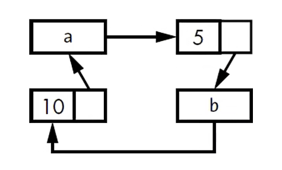

# PART1. Rust可能发生内存泄漏

- Rust的内存安全机制可以保证**很难**发生内存泄漏,但**不是不可能**
- 例如使用`Rc<T>`和`RefCell<T>`就可能创造出循环引用,从而发生内存泄漏:
  - 发生内存泄漏的场景下,每个语法项的引用数量永远不会减少到0,因此值也不会释放

这里我们修改之前的Cons的实现,使其可以修改下一个节点的值:

```rust
use std::cell::RefCell;
use std::rc::Rc;

#[derive(Debug)]
enum List {
    Cons(i32, RefCell<Rc<List>>),
    Nil,
}

impl List {
    /// tail 方法返回当前节点的下一个节点
    fn tail(&self) -> Option<&RefCell<Rc<List>>> {
        match self {
            // 此处的_表示忽略Cons中的第一个元素 只匹配第二个元素
            List::Cons(_, item) => Some(item),
            List::Nil => None,
        }
    }
}

fn main() {
    let value = List::Cons(5, RefCell::new(Rc::new(List::Nil)));

    let a = List::Cons(10, RefCell::new(Rc::new(value)));

    println!("{:?}", a);

    if let Some(tail) = a.tail() {
        *tail.borrow_mut() = Rc::new(List::Cons(20, RefCell::new(Rc::new(List::Nil))));
    }

    println!("{:?}", a);
}
```

```
cargo run
   Compiling cycle_reference v0.1.0 (/cycle_reference)
...

warning: `cycle_reference` (bin "cycle_reference") generated 1 warning
    Finished `dev` profile [unoptimized + debuginfo] target(s) in 0.29s
     Running `target/debug/cycle_reference`
Cons(10, RefCell { value: Cons(5, RefCell { value: Nil }) })
Cons(10, RefCell { value: Cons(20, RefCell { value: Nil }) })
```

可以看到,现在我们可以通过节点`a`修改节点`value`的值

现在,我们来考虑这样的情况:

- step1. 创建一个列表`a`
- step2. 创建一个列表`b`,其中`b`的下一个节点指向`a`
- step3. 修改列表`a`的下一个节点指向`b`

会发生什么情况呢?

```rust
use std::cell::RefCell;
use std::rc::Rc;
use crate::List::Cons;

#[derive(Debug)]
enum List {
    Cons(i32, RefCell<Rc<List>>),
    Nil,
}

impl List {
    /// tail 方法返回当前节点的下一个节点
    fn tail(&self) -> Option<&RefCell<Rc<List>>> {
        match self {
            // 此处的_表示忽略Cons中的第一个元素 只匹配第二个元素
            List::Cons(_, item) => Some(item),
            List::Nil => None,
        }
    }
}

fn main() {
    let a = Rc::new(Cons(5, RefCell::new(Rc::new(List::Nil))));

    // a的强引用计数为1
    println!("a initial rc count = {}", Rc::strong_count(&a));
    // a的下一个节点为Nil
    println!("a next item = {:?}", a.tail());

    let b = Rc::new(Cons(10, RefCell::new(Rc::clone(&a))));

    // 创建b后 a的强引用计数为2
    println!("a rc count after b creation = {}", Rc::strong_count(&a));
    // b的强引用计数为1
    println!("b initial rc count = {}", Rc::strong_count(&b));
    // b的下一个节点为a
    println!("b next item = {:?}", b.tail());

    // 修改a的下一个节点为b
    if let Some(link) = a.tail() {
        *link.borrow_mut() = Rc::clone(&b);
    }

    // b的强引用计数为2
    println!("b rc count after changing a = {}", Rc::strong_count(&b));
    // a的强引用计数为2
    println!("a rc count after changing a = {}", Rc::strong_count(&a));

    // 以下代码可以观察到循环引用 这会造成栈溢出
    // println!("a next item = {:?}", a.tail());
}
```

```
cargo run
   Compiling cycle_reference_example_1 v0.1.0 (/cycle_reference_example_1)
...

warning: `cycle_reference_example_1` (bin "cycle_reference_example_1") generated 1 warning
    Finished `dev` profile [unoptimized + debuginfo] target(s) in 0.96s
     Running `target/debug/cycle_reference_example_1`
a initial rc count = 1
a next item = Some(RefCell { value: Nil })
a rc count after b creation = 2
b initial rc count = 1
b next item = Some(RefCell { value: Cons(5, RefCell { value: Nil }) })
b rc count after changing a = 2
a rc count after changing a = 2
```

可以看到,此时`a`和`b`的强引用计数都为2,这是因为`a`和`b`互相引用,导致引用计数永远不会减少到0,如下图示:



那么此时如果打印`a`的下一个节点,它应该是一个"引用了a的b"的节点,这样就会形成一个循环引用,从而导致栈溢出

```rust
use std::cell::RefCell;
use std::rc::Rc;
use crate::List::Cons;

#[derive(Debug)]
enum List {
    Cons(i32, RefCell<Rc<List>>),
    Nil,
}

impl List {
    /// tail 方法返回当前节点的下一个节点
    fn tail(&self) -> Option<&RefCell<Rc<List>>> {
        match self {
            // 此处的_表示忽略Cons中的第一个元素 只匹配第二个元素
            List::Cons(_, item) => Some(item),
            List::Nil => None,
        }
    }
}

fn main() {
    let a = Rc::new(Cons(5, RefCell::new(Rc::new(List::Nil))));

    // a的强引用计数为1
    println!("a initial rc count = {}", Rc::strong_count(&a));
    // a的下一个节点为Nil
    println!("a next item = {:?}", a.tail());

    let b = Rc::new(Cons(10, RefCell::new(Rc::clone(&a))));

    // 创建b后 a的强引用计数为2
    println!("a rc count after b creation = {}", Rc::strong_count(&a));
    // b的强引用计数为1
    println!("b initial rc count = {}", Rc::strong_count(&b));
    // b的下一个节点为a
    println!("b next item = {:?}", b.tail());

    // 修改a的下一个节点为b
    if let Some(link) = a.tail() {
        *link.borrow_mut() = Rc::clone(&b);
    }

    // b的强引用计数为2
    println!("b rc count after changing a = {}", Rc::strong_count(&b));
    // a的强引用计数为2
    println!("a rc count after changing a = {}", Rc::strong_count(&a));

    // 以下代码可以观察到循环引用 这会造成栈溢出
    println!("a next item = {:?}", a.tail());
}
```

```
cargo run
   Compiling cycle_reference_example_1 v0.1.0 (/cycle_reference_example_1)
...

warning: `cycle_reference_example_1` (bin "cycle_reference_example_1") generated 1 warning
    Finished `dev` profile [unoptimized + debuginfo] target(s) in 0.87s
     Running `target/debug/cycle_reference_example_1`
a initial rc count = 1
a next item = Some(RefCell { value: Nil })
a rc count after b creation = 2
b initial rc count = 1
b next item = Some(RefCell { value: Cons(5, RefCell { value: Nil }) })
b rc count after changing a = 2
a rc count after changing a = 2
a next item = Some(RefCell { value: Cons(10, RefCell { value: Cons(5, RefCell { value: Cons(10, RefCell { value: Cons(5, 
... 
thread 'main' has overflowed its stack
fatal runtime error: stack overflow
zsh: abort      cargo run
```

## PART2. 防止内存泄漏的解决办法

- 依靠开发者来保证,不能完全依靠Rust
- 重新组织数据结构: 将引用分为2种:
  - 持有所有权的引用
  - 不持有所有权的引用

应用到上例中的环形结构中,就是:

- 循环引用中的一部分引用持有所有权,而另一部分引用不持有所有权
- 因为只有持有所有权的引用才影响值的清理

# PART3. 防止循环引用,将`Rc<T>`换成`Weak<T>`

- `Rc::clone()`方法会为`Rc<T>`实例的`strong_count`值+1;而`Rc<T>`实例只有在`strong_count`值为0时才会被清理
- `Rc<T>`实例可以通过调用`Rc::downgrade()`方法创建一个值的Weak Reference(弱引用)
  - 该方法返回一个`Weak<T>`类型的智能指针
  - 调用该方法会为`Rc<T>`实例的`weak_count`值+1
- `Rc<T>`实例使用`weak_count`来追踪存在多少`Weak<T>`引用
- `Rc<T>`实例的`weak_count`不为0并不影响`Rc<T>`实例的清理

# PART4. Strong VS Weak

- Strong Reference(强引用)是关于如何分享`Rc<T>`实例的所有权的
- Weak Reference(弱引用)是用于防止循环引用的
  - 例如在一个双向链表或图结构中,弱引用可用于指回的节点
  - 或者用于缓存值,当缓存值不再被使用时,可以清理缓存
  - 也可以用于观察者模式中,避免观察者和被观察者之间的循环引用,使得被观察者可以再没有观察者时被释放
  - 当Strong Reference的数量为0时,Weak Reference会自动断开
- 在使用`Weak<T>`之前,需要保证它指向的值仍然存在:
  - 通过调用`Weak<T>.upgrade()`方法,返回一个`Option<Rc<T>>`
    - 如果`Rc<T>`实例还存在,则返回`Some`
    - 如果`Rc<T>`实例已经被清理,则返回`None`

此处我们创建一棵树,树中的每个子节点都能够指向自己的父节点

- step1. 创建一个能够指向子节点的结构体`Node`,它可以存储一个`i32`值和一个指向它所有子节点的引用

```rust
use std::cell::RefCell;
use std::rc::Rc;

#[derive(Debug)]
struct Node {
    value: i32,
    children: RefCell<Vec<Rc<Node>>>
}

fn main() {
    println!("Hello, world!");
}
```

这里将`Vec<T>`的元素类型定义为`Rc<Node>`,是为了以共享所有权的方式来直接访问到树中的每一个Node

而且,为了便于修改节点之间的父子关系,所以将`children`字段定义为`RefCell<T>`

- step2. 使用该结构体定义一个值为3的叶子节点,然后再定义一个值为5的子节点,并将子节点添加到叶子节点的子节点列表中

```rust
use std::cell::RefCell;
use std::rc::Rc;

#[derive(Debug)]
struct Node {
  value: i32,
  children: RefCell<Vec<Rc<Node>>>
}

fn main() {
  // 叶子节点
  let leaf = Rc::new(Node {
    value: 3,
    children: RefCell::new(vec![])
  });

  // 子节点
  let branch = Rc::new(Node {
    value: 5,
    children: RefCell::new(vec![Rc::clone(&leaf)])
  });
}
```

注意:

在将叶子节点添加到子节点的过程中,调用了`Rc::clone()`关联函数,所以此时值为3的Node有2个所有者:`leaf`和`branch`

- step3. 增加子节点指向父节点的引用

首先,使用`Rc<T>`肯定不是一个好的选择.使用`Rc<T>`就会出现循环引用的情况:

当`branch.children`指向`leaf`时,`leaf.parent`也指向了`branch`,这会导致`branch`和`leaf`的`strong_count`都无法归零

这里再来考虑父子节点之间的关系:

父节点自然应该持有子节点的所有权,因为当父节点被释放时,子节点也应该随之被释放;

而子节点却不应该持有父节点的所有权,因为父节点是否被释放,不应该受子节点的影响

因此,应该使用`Weak<T>`来指向父节点:

```rust
use std::cell::RefCell;
use std::rc::{Rc, Weak};

#[derive(Debug)]
struct Node {
    value: i32,
    parent: RefCell<Weak<Node>>,
    children: RefCell<Vec<Rc<Node>>>,
}
```

然后在创建`branch`之后,将`leaf`的`parent`字段指向`branch`:

```rust
use std::cell::RefCell;
use std::rc::{Rc, Weak};

#[derive(Debug)]
struct Node {
    value: i32,
    parent: RefCell<Weak<Node>>,
    children: RefCell<Vec<Rc<Node>>>,
}

fn main() {
    // 叶子节点
    let leaf = Rc::new(Node {
        value: 3,
        parent: RefCell::new(Weak::new()),
        children: RefCell::new(vec![]),
    });

    // Weak<T>.upgrade()方法将返回一个Option<Rc<T>>类型
    // 若Weak<T>指向的Rc<T>对象未被释放,则返回 Some(Rc<T>)
    // 若Weak<T>指向的Rc<T>对象已被释放,则返回 None
    // 此时leaf.parent.borrow().upgrade()返回None
    println!("leaf parent = {:?}", leaf.parent.borrow().upgrade());

    // 子节点
    let branch = Rc::new(Node {
        value: 5,
        parent: RefCell::new(Weak::new()),
        children: RefCell::new(vec![Rc::clone(&leaf)]),
    });

    // 为叶子节点添加指向父节点的弱引用
    // step1. leaf.parent.borrow_mut() 返回一个 RefMut<Weak<Node>> 类型,该类型也是一个智能指针
    // step2. 对该指针解引用并赋值为 Rc::downgrade(&branch) 注意Rc::downgrade(&branch)返回一个Weak<Node>类型
    *leaf.parent.borrow_mut() = Rc::downgrade(&branch);

    // 再次访问leaf.parent.borrow().upgrade()时,返回Some(Rc<Node>)
    println!("leaf parent = {:?}", leaf.parent.borrow().upgrade());
}
```

```
cargo run
   Compiling weak_reference_example v0.1.0 (/weak_reference_example)
...

warning: `weak_reference_example` (bin "weak_reference_example") generated 1 warning
    Finished `dev` profile [unoptimized + debuginfo] target(s) in 6.19s
     Running `target/debug/weak_reference_example`
leaf parent = None
leaf parent = Some(Node { value: 5, parent: RefCell { value: (Weak) }, children: RefCell { value: [Node { value: 3, parent: RefCell { value: (Weak) }, children: RefCell { value: [] } }] } })
```

然后再观察一下`leaf`和`branch`的强弱引用计数的变化情况,这一次我们通过修改`branch`的作用域来观察强引用计数和弱引用计数的变化:

```rust
use std::cell::RefCell;
use std::rc::{Rc, Weak};

#[derive(Debug)]
struct Node {
    value: i32,
    parent: RefCell<Weak<Node>>,
    children: RefCell<Vec<Rc<Node>>>,
}

fn main() {
    // 叶子节点
    let leaf = Rc::new(Node {
        value: 3,
        parent: RefCell::new(Weak::new()),
        children: RefCell::new(vec![]),
    });

    println!("leaf parent = {:?}", leaf.parent.borrow().upgrade());

    // 此时 leaf的强引用计数值为1 弱引用计数值为0
    println!("leaf strong = {}, weak = {}", Rc::strong_count(&leaf), Rc::weak_count(&leaf));

    {
        // 子节点
        let branch = Rc::new(Node {
            value: 5,
            parent: RefCell::new(Weak::new()),
            children: RefCell::new(vec![Rc::clone(&leaf)]),
        });

        *leaf.parent.borrow_mut() = Rc::downgrade(&branch);

        // 此时 branch的强引用计数值为1 弱引用计数值为1
        println!("branch strong = {}, weak = {}", Rc::strong_count(&branch), Rc::weak_count(&branch));

        // 此时 leaf的强引用计数为2 弱引用计数值为0
        println!("leaf strong = {}, weak = {}", Rc::strong_count(&leaf), Rc::weak_count(&leaf));
    } // 此处branch走出作用域 leaf的强引用减1 branch的强引用减1,此时branch的强引用计数为0,branch被释放

    // 此时 leaf指向的父节点已经被释放 所以此时leaf的父节点为空
    println!("leaf parent = {:?}", leaf.parent.borrow().upgrade());

    // 此时 leaf的强引用计数为1 弱引用计数值为0
    println!("leaf strong = {}, weak = {}", Rc::strong_count(&leaf), Rc::weak_count(&leaf));
} // leaf走出作用域 leaf的强引用减1,此时leaf的强引用计数为0,leaf被释放
```

```
cargo run
   Compiling weak_reference_example_1 v0.1.0 (/weak_reference_example_1)
...

warning: `weak_reference_example_1` (bin "weak_reference_example_1") generated 1 warning
    Finished `dev` profile [unoptimized + debuginfo] target(s) in 0.78s
     Running `target/debug/weak_reference_example_1`
leaf parent = None
leaf strong = 1, weak = 0
branch strong = 1, weak = 1
leaf strong = 2, weak = 0
leaf parent = None
leaf strong = 1, weak = 0
```

可以看到,当`branch`走出作用域时,虽然它的弱引用计数为1,但由于其强引用计数为0,所以`branch`被释放

这也证明了:弱引用不影响值的生命周期