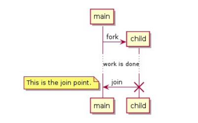

# PART1. 并发

- Concurrent: 程序的不同部分之间**独立**的运行
- Parallel: 程序的不同部分**同时**运行

- Rust无畏并发: 允许你编写没有细微Bug的代码,并在不引入新Bug的情况下易于重构
  - 这里所谓的"细微Bug",指的是那些比较诡异的Bug
  - 比如: 由于并发导致的数据竞争,导致的难以复现的Bug
- 注意: 本课程中的"并发"泛指Concurrent和Parallel

# PART2. 进程与线程

- 在大部分OS中,代码运行在 **进程(process)** 中,OS同时管理多个进程
- 在你的程序里,个独立部分可以同时运行,运行这些独立部分的就是 **线程(thread)**
- 由于多个线程是可以同时运行的,所以通常会把程序的计算拆分为多个线程,以便同时运行:
  - 优点是提升了性能的表现
  - 但同时也增加了复杂性:无法保障各个线程的执行顺序

# PART3. 多线程可导致的问题

- 竞态条件(race condition): 当两个线程同时访问同一数据时,并且至少有一个线程在写入数据时,就会发生竞态条件
  - 简而言之就是:线程以不一致的顺序访问数据或资源
  - 假设线程A负责写入数据,线程B负责读取数据,那么线程B可能会读取到线程A写入一半的数据
- 死锁(dead lock): 两个线程相互等待对方释放资源,导致两个线程都无法继续执行
- 只在某些条件下才会发生的Bug: 由于线程的执行顺序不确定,所以只在某些特定的条件下才会发生Bug,这种Bug很难复现

# PART4. 编程语言实现线程的方式

- 通过调用OS的API来创建线程: 1:1模型
  - 即:1个OS线程对应1个语言线程
    - 优点: 需要较小的运行时开销
    - 缺点: 创建线程的开销较大

- 语言自己实现的线程(绿色线程): M:N模型
  - 即:M个语言线程对应N个OS线程
    - 优点: 创建线程的开销较小
    - 缺点: 需要较大的运行时开销

- Rust: 需要权衡运行时的支持
  - 其实除了汇编语言之外,所有的语言都需要运行时支持
  - 像C/C++这种语言,虽然说是没有运行时,但只是它们的运行时比较小而已
    - 也因为它们的运行时功能较少,所以它们最终编译出来的二进制也比较小
    - 这也使得这种语言在多种场景下都可以与其他语言组合使用
  - 而也有一些语言,增加运行时的功能,比如JAVA/C#/GO等
    - 这些语言的运行时功能较多,所以最终编译出来的二进制也较大
    - 但是这些语言的运行时功能较多,所以在某些场景下,这些语言的运行时功能会更加强大
  - 而对于Rust而言,则是尽可能保持没有运行时的状态
    - 这样方便与C交互
    - 且可以获得较高的性能
    - **因此,Rust标准库仅提供1:1模型的线程**
    - 但是由于Rust有良好的底层抽象能力,在社区里也有一些实现了M:N模型的库
      - 比如: tokio,async-std等

# PART5. 通过`spawn`创建线程

- 通过`thread::spawn()`函数可以创建新线程
  - 参数: 一个闭包(该闭包表示在新线程里运行的代码)

例:

```rust
use std::thread;
use std::time::Duration;

fn main() {
  // 创建一个新线程
  // fork点
  thread::spawn(|| {
    for i in 1..10 {
      println!("hi number {} from the spawned thread!", i);
      thread::sleep(Duration::from_millis(200));
    }
  });

  for i in 1..5 {
    println!("hi number {} from the main thread!", i);
    thread::sleep(Duration::from_millis(200));
  }

  // 当主线程结束时,无论子线程是否结束,整个程序都会结束
  // 这段代码中没有join点
}
```

```
cargo run
   Compiling spawn_example_1 v0.1.0 (/spawn_example_1)
    Finished `dev` profile [unoptimized + debuginfo] target(s) in 5.64s
     Running `target/debug/spawn_example_1`
hi number 1 from the main thread!
hi number 1 from the spawned thread!
hi number 2 from the main thread!
hi number 2 from the spawned thread!
hi number 3 from the main thread!
hi number 3 from the spawned thread!
hi number 4 from the main thread!
hi number 4 from the spawned thread!    // 此处 主线程循环到4 即将结束 但还有点时间 因此子线程又继续循环了2次
hi number 5 from the spawned thread!
```



- `thread::sleep()`: 该函数会导致当前线程休眠一段时间
  - 参数: 一个`Duration`类型的参数
  - `Duration::from_millis(200)`: 200毫秒

# PART6. 通过`JoinHandle`等待线程结束

- `thread::spawn()`函数会返回一个`JoinHandle`实例
  - `JoinHandle`是持有值的所有权的
    - 这里所谓的持有值的所有权,是指当你使用`thread::spawn()`函数创建一个新线程时,返回的`JoinHandle`实例拥有这个线程的所有权
    - 你拥有这个`JoinHandle`实例,就意味着你拥有这个线程的控制权,具体是指:
      - 等待线程完成执行.通过`JoinHandle.join()`方法,可以阻塞当前线程,直到`JoinHandle`实例拥有的线程执行完成.
        - 这是同步操作,它可以确保线程的执行顺序和资源的正确释放
      - 获取线程的返回值.如果线程通过闭包返回了一个值,那么在`JoinHandle.join()`方法成功返回后,可以获取这个值,这允许线程执行完成后传递结果

- `joinHandle.join()`方法的返回值是一个`Result`枚举
  - 如果线程执行成功,则返回`Ok`枚举,并包含线程的返回值
  - 如果线程执行失败,则返回`Err`枚举,并包含一个`panic`的错误信息

例:

```rust
use std::thread;
use std::time::Duration;

fn main() {
    let join_handle = thread::spawn(|| {
        for i in 1..10 {
            println!("hi number {} from the spawned thread!", i);
            thread::sleep(Duration::from_millis(200));
        }
    });

    for i in 1..5 {
        println!("hi number {} from the main thread!", i);
        thread::sleep(Duration::from_millis(200));
    }

    // join点
    join_handle.join().unwrap();
}
```

```
cargo run
   Compiling spawn_example_2 v0.1.0 (/spawn_example_2)
    Finished `dev` profile [unoptimized + debuginfo] target(s) in 5.25s
     Running `target/debug/spawn_example_2`
hi number 1 from the main thread!
hi number 1 from the spawned thread!
hi number 2 from the main thread!
hi number 2 from the spawned thread!
hi number 3 from the main thread!
hi number 3 from the spawned thread!
hi number 4 from the main thread!
hi number 4 from the spawned thread!
hi number 5 from the spawned thread!
hi number 6 from the spawned thread!
hi number 7 from the spawned thread!
hi number 8 from the spawned thread!
hi number 9 from the spawned thread!
```

如果把join点提前到主线程的循环之前,则会导致主线程等待子线程执行完成,这样就会编程主线程和子线程的执行顺序变成串行执行:

```rust
use std::thread;
use std::time::Duration;

fn main() {
    let join_handle = thread::spawn(|| {
        for i in 1..10 {
            println!("hi number {} from the spawned thread!", i);
            thread::sleep(Duration::from_millis(200));
        }
    });

    // join点在主线程开始之前 即: 子线程与主线程串行执行
    join_handle.join().unwrap();

    for i in 1..5 {
        println!("hi number {} from the main thread!", i);
        thread::sleep(Duration::from_millis(200));
    }
}
```

```
cargo run
   Compiling spawn_example_3 v0.1.0 (/spawn_example_3)
    Finished `dev` profile [unoptimized + debuginfo] target(s) in 0.39s
     Running `target/debug/spawn_example_3`
hi number 1 from the spawned thread!
hi number 2 from the spawned thread!
hi number 3 from the spawned thread!
hi number 4 from the spawned thread!
hi number 5 from the spawned thread!
hi number 6 from the spawned thread!
hi number 7 from the spawned thread!
hi number 8 from the spawned thread!
hi number 9 from the spawned thread!
hi number 1 from the main thread!
hi number 2 from the main thread!
hi number 3 from the main thread!
hi number 4 from the main thread!
```

# PART7. 通过`move`闭包捕获环境

- `move`闭包通常和`thread::spawn()`函数一起使用,它允许你使用其他线程的数据
- 创建线程时,把值的所有权从一个线程转移到另一个线程,这样就可以在新线程中使用这个值

例:

```rust
use std::thread;

fn main() {
    let v = vec![1, 2, 3];

    // 子线程中运行的闭包没有使用move关键字 但使用了主线程中的数据
    let join_handle = thread::spawn(|| {  // error: closure may outlive the current function, but it borrows `v`, which is owned by the current function
        println!("Here's a vector: {:?}", v);
    });

    join_handle.join().unwrap();
}
```

```
 cargo run
   Compiling move_example_1 v0.1.0 (/move_example_1)
error[E0373]: closure may outlive the current function, but it borrows `v`, which is owned by the current function
 --> src/main.rs:7:37
  |
7 |     let join_handle = thread::spawn(|| {
  |                                     ^^ may outlive borrowed value `v`
8 |         println!("Here's a vector: {:?}", v);
  |                                           - `v` is borrowed here
  |
note: function requires argument type to outlive `'static`
 --> src/main.rs:7:23
  |
7 |       let join_handle = thread::spawn(|| {
  |  _______________________^
8 | |         println!("Here's a vector: {:?}", v);
9 | |     });
  | |______^
help: to force the closure to take ownership of `v` (and any other referenced variables), use the `move` keyword
  |
7 |     let join_handle = thread::spawn(move || {
  |                                     ++++

For more information about this error, try `rustc --explain E0373`.
error: could not compile `move_example_1` (bin "move_example_1") due to 1 previous error
```

- may outlive borrowed value `v`: 编译器确实推断出了在闭包中只需要`v`的借用即可.但是,闭包的生命周期可能会长于`v`的生命周期,例如:

```rust
use std::thread;

fn main() {
    let v = vec![1, 2, 3];

    let join_handle = thread::spawn(|| {
        println!("Here's a vector: {:?}", v);
    });

    drop(v); // 提前释放v 由于子线程和主线程是并行的 因此有可能出现的情况是: 子线程在主线程释放v之后才开始执行

    join_handle.join().unwrap();
}
```

- help: to force the closure to take ownership of `v` (and any other referenced variables), use the `move` keyword: 为了强制闭包获取`v`的所有权,使用`move`关键字

```rust
use std::thread;

fn main() {
    let v = vec![1, 2, 3];

    let join_handle = thread::spawn(move || {
        println!("Here's a vector: {:?}", v);
    });

    join_handle.join().unwrap();
}
```

```
cargo run
   Compiling move_example_3 v0.1.0 (/move_example_3)
    Finished `dev` profile [unoptimized + debuginfo] target(s) in 0.37s
     Running `target/debug/move_example_3`
Here's a vector: [1, 2, 3]
```

注意: 如果在`move`关键字之后,主线程再次使用`v`,则会导致编译错误:

```rust
use std::thread;

fn main() {
    let v = vec![1, 2, 3];

    let join_handle = thread::spawn(move || {
        println!("Here's a vector: {:?}", v);
    });

    drop(v);  // error: value used here after move

    join_handle.join().unwrap();
}
```

```
cargo run
   Compiling move_example_4 v0.1.0 (/move_example_4)
error[E0382]: use of moved value: `v`
  --> src/main.rs:10:10
   |
4  |     let v = vec![1, 2, 3];
   |         - move occurs because `v` has type `Vec<i32>`, which does not implement the `Copy` trait
5  |
6  |     let join_handle = thread::spawn(move || {
   |                                     ------- value moved into closure here
7  |         println!("Here's a vector: {:?}", v);
   |                                           - variable moved due to use in closure
...
10 |     drop(v);  // error: use of moved value: `v`
   |          ^ value used here after move

For more information about this error, try `rustc --explain E0382`.
error: could not compile `move_example_4` (bin "move_example_4") due to 1 previous error
```