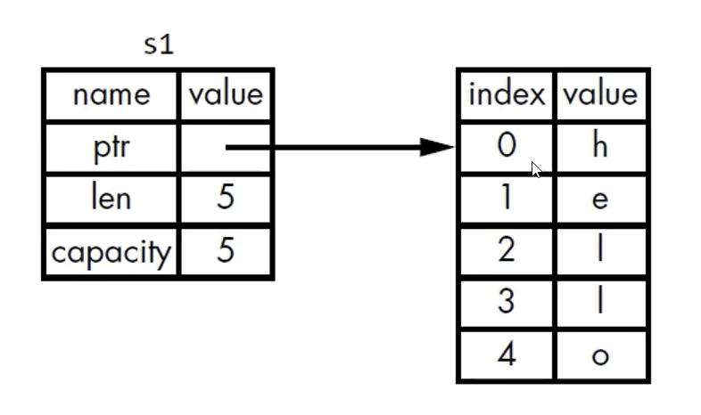
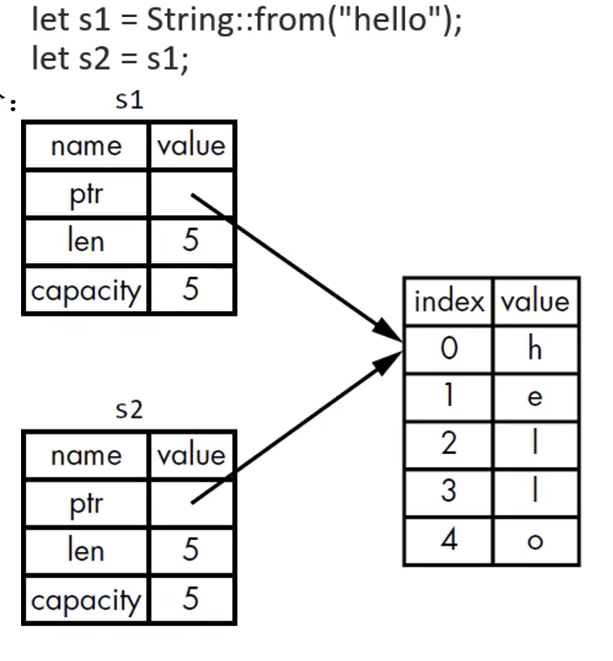
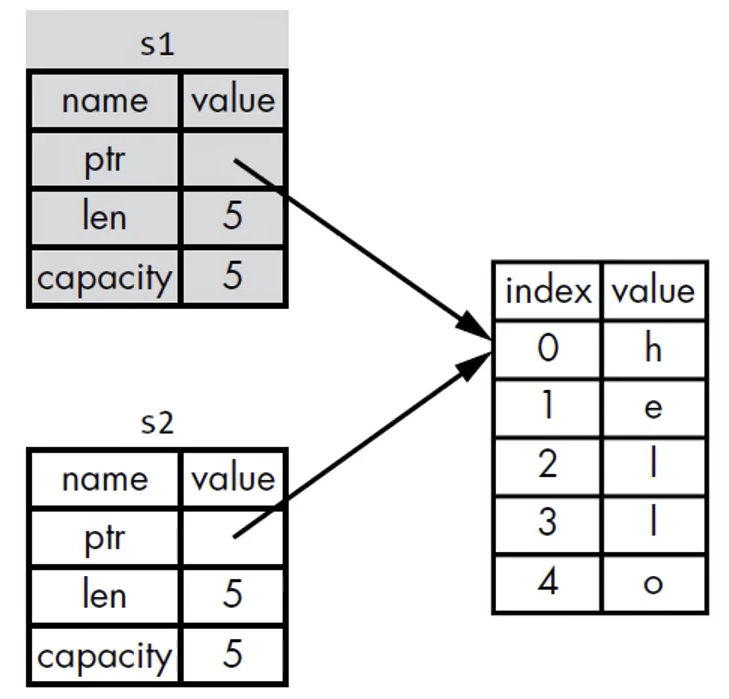
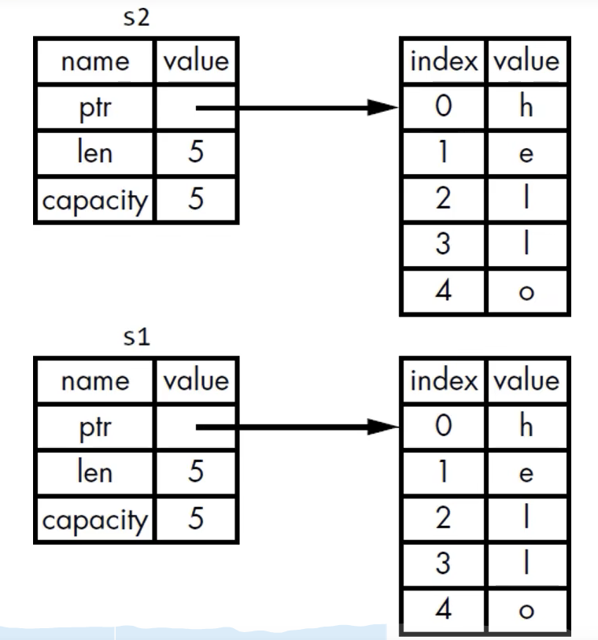

# PART1. 所有权规则

- 每个值都有一个变量,这个变量是该值的所有者
- 每个值同时只能有一个所有者
- 当所有者超出作用域(Scope)时,值将被删除

# PART2. String

String比基础标量数据类型更复杂.标量数据类型大小固定,是分配在Stack上的,而String是分配在Heap上的.

String的字面值:程序中手写的字符串值.它们是不可变的

String是分配在Heap上的,能够存储在编译时未知大小的文本

## 2.1 创建String类型的值

从字符串字面量创建String类型的值

```rust
fn main() {
    // :: 表示from()是String这个类型下(或者说是String这个模块下)的一个函数
    let mut s = String::from("hello");

    // 这类字符串就可以被修改
    s.push_str(", world!");
    println!("{}", s);
}
```

String类型的值可以修改,而字面量字符串不可以.这是因为它们处理内存的方式不同

## 2.2 内存与分配

- 字符串字面值,在编译时就确定其内容了,其文本内容直接被硬编码到最终的可执行文件中了
  - 速度快、高效.是因为其不可变性 
- String类型的值,为了支持其可变性,需要在Heap上分配内存,来保存编译时未知的文本内容
  - 这就意味着OS必须在运行时来请求内存
    - `String::from()`实现了这一步
  - 当用完String类型的值之后,需要使用某种方式将内存返还给OS
    - 在有GC的语言中,GC会跟踪并清理不再使用的内存
    - 而没有GC的语言,则需要我们自行识别内存何时不再使用,并调用代码来释放内存
      - 在本例中,当`s`离开作用域时,Rust会自动调用`drop()`函数来释放内存 
      - 没做这一步,则会出现内存泄漏
      - 提前做了这一步,则变量就非法了
      - 做了2次,也是Bug.1次分配对应1次释放

而Rust则采用了不同的方式:对于某个值而言,当拥有它的变量走出了作用域范围时,内存就会立即自动交还给OS

```rust
fn main() {
    // :: 表示from()是String这个类型下(或者说是String这个模块下)的一个函数
    let mut s = String::from("hello");

    // 这类字符串就可以被修改
    s.push_str(", world!");
    println!("{}", s);
} // s离开作用域,Rust自动调用drop()函数,释放内存
```

## 2.3 移动(Move)

多个变量可以与同一个数据使用一种独特的方式来交互:

### 2.3.1 case1: int类型

```rust
fn main() {
    // 数据5绑定到了变量x上
    let x = 5;
    // 创建了一个变量x的副本(也就是5的副本),将这个副本绑定到了变量y上
    let y = x;
}
```

本例中`x`和`y`都是i32类型,这两个5都被压入了Stack中

### 2.3.2 case2: String类型

```rust
fn main() {
    let s1 = String::from("hello");
    // s1的数据被移动到了s2上
    let s2 = s1;
}
```



一个String类型的值包含了3部分:

- 指向存放在Heap上的数据的指针(ptr)
- 长度(len):存放字符串所需的字节数
- 容量(capacity):String类型从OS处总共获得的字节数

图片中左侧的部分(String类型的元数据)是存放在Stack上的,而右侧的实际数据则被存放在Heap上

当把`s1`赋值给`s2`时,效果如下图示:



- 在Stack上复制了一份元数据(ptr,len,capacity)
- 但是实际数据(Heap上的数据)并没有被复制,而是直接指向了Heap上的数据

当变量离开作用域时,Rust会自动调用`drop()`函数,释放内存.但是这里有个问题:当`s1`和`s2`同时离开作用域时,它们都会尝试释放相同的内存,此时会发生什么?

```rust
fn main() {
    let s1 = String::from("hello");
    let s2 = s1;
} // s1和s2同时离开作用域,此时二者均调用drop方法,会导致二次释放内存,这会引发bug
```

- 二次释放(double free)Bug

为了保证内存安全,Rust没有采用深拷贝(就是把Heap上的数据也复制一份),而是让`s1`失效

当`s1`离开作用域时,Rust不需要释放任何东西

当`s2`创建后再使用`s1`:

```rust
fn main() {
    let s1 = String::from("hello");
    // 此时s1的所有权被转移给了s2
    let s2 = s1;

    println!("{}", s1);
}
```

```bash
cargo run
   Compiling move_string v0.1.0 (/move_string)
warning: unused variable: `s2`
 --> src/main.rs:4:9
  |
4 |     let s2 = s1;
  |         ^^ help: if this is intentional, prefix it with an underscore: `_s2`
  |
  = note: `#[warn(unused_variables)]` on by default

error[E0382]: borrow of moved value: `s1`
 --> src/main.rs:6:20
  |
2 |     let s1 = String::from("hello");
  |         -- move occurs because `s1` has type `String`, which does not implement the `Copy` trait
3 |     // 此时s1的所有权被转移给了s2
4 |     let s2 = s1;
  |              -- value moved here
5 |
6 |     println!("{}", s1);
  |                    ^^ value borrowed here after move
  |
  = note: this error originates in the macro `$crate::format_args_nl` which comes from the expansion of the macro `println` (in Nightly builds, run with -Z macro-backtrace for more info)
help: consider cloning the value if the performance cost is acceptable
  |
4 |     let s2 = s1.clone();
  |                ++++++++

For more information about this error, try `rustc --explain E0382`.
warning: `move_string` (bin "move_string") generated 1 warning
error: could not compile `move_string` (bin "move_string") due to 1 previous error; 1 warning emitted
```

报错信息表明`s1`的所有权已经被转移给了`s2`,所以`s1`不能再被使用了.这也就是所有权规则中的**每个值同时只能有一个所有者**

- move occurs because `s1` has type `String`, which does not implement the `Copy` trait:`s1`的类型是String,它没有实现Copy trait,所以move操作发生了
- -- value moved here:值在这里被移动了
- ^^ value borrowed here after move:值在移动之后被借用了

- 浅拷贝(shallow copy)
- 深拷贝(deep copy)

你也许会认为复制Stack上的数据是浅拷贝,但由于Rust在复制Stack上的数据的同时让s1失效了,因此我们采用一个新的术语:move



初态`s1`指向了Heap上的数据,当`s1`被赋值给`s2`时,`s1`失效了,而`s2`指向了Heap上的数据.这就是move

既然只有`s2`是有效的,因此只有`s2`会在离开自己作用域时释放内存空间,而`s1`不会.因此也就不存在二次释放的问题了

这里也隐含了一个设计原则:Rust不会自动创建数据的深拷贝.这也就意味着,就运行时而言,任何自动赋值操作都是廉价的

## 2.3 克隆(Clone)

如果确实想对Heap上的String数据进行深拷贝,而不仅仅是复制Stack上的数据,可以使用`clone()`方法

```rust
fn main() {
    let s1 = String::from("hello");
    let s2 = s1.clone();
    println!("s1 = {}, s2 = {}", s1, s2);
}
```

```bash
cargo run
   Compiling clone_string v0.1.0 (/clone_string)
    Finished `dev` profile [unoptimized + debuginfo] target(s) in 0.96s
     Running `target/debug/clone_string`
s1 = hello, s2 = hello
```



这里的`clone()`方法是深拷贝,它会复制Heap上的数据,而不仅仅是Stack上的数据.这种操作是昂贵的,因为它涉及到了Heap上的数据的复制

## 2.4 复制(Copy)

针对Stack上的数据进行拷贝的操作叫做复制(Copy).Rust中的基础数据类型都实现了Copy trait,因此它们的值可以在赋值操作中进行复制

```rust
fn main() {
  let x = 5;
  // 这里将x赋值给y时,由于x的数据完整的保存在Stack上,因此这里的赋值操作是复制操作
  // 而复制操作不会让x失效,因此x和y都是有效的.说白了复制和我们认知中的浅拷贝是一样的
  let y = x;
  println!("x = {}, y = {}", x, y);
}
```

```bash
cargo run
   Compiling moves v0.1.0 (/moves)
    Finished `dev` profile [unoptimized + debuginfo] target(s) in 0.22s
     Running `target/debug/moves`
x = 5, y = 5
```

Copy trait可以用于像整型这种完全存放在Stack上的数据.

如果一个类型实现了Copy trait,那么它的值可以在赋值操作中进行复制,而不会让原来的值失效.

如果一个类型或该类型的一部分实现了Drop trait,那么Rust不允许其实现Copy trait.

因为Copy trait是针对Stack上的数据进行的操作,而Drop trait是针对Heap上的数据进行操作.这两者是冲突的

`drop()`函数是用于释放Heap的,而非Stack

## 2.5 一些拥有Copy trait的类型

- 任何简单标量的组合类型都是Copy的
  - 所有整型
  - 浮点型
  - 布尔型
  - 字符型
  - 元组,当其元素都是Copy的时候
    - (i32, i32)是Copy的
    - (String, i32)不是Copy的
- 任何需要分配内存或某种资源的类型都不是Copy的
  - 所有String类型
  - 所有Vec类型
  - 所有实现了Drop trait的类型
  - 所有引用类型