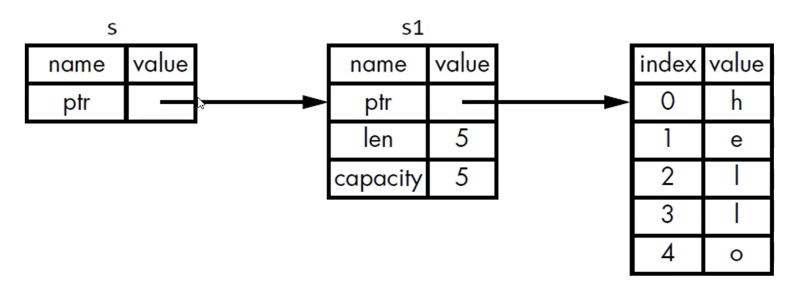

# PART1. 引用

引用(&): 一个对象的别名,通过引用可以直接访问对象的值.但是引用不是对象本身,引用可以改变,但是对象不会改变

# PART2. 借用

## 2.1 借用的定义

```rust
fn main() {
    let s1 = String::from("hello");
    // step1. 调用函数时,并没有将s1的数据所有权移动给函数;而是将s1的引用传递给函数
    // Tips: &符号表示引用,引用允许你使用值但不获取其所有权
    let len = calculate_length(&s1);

    // step2. s1的所有权并没有被移动,所以可以继续使用
    println!("The length of '{}' is {}.", s1, len);
}

fn calculate_length(s: &String) -> usize {
    s.len()
} // s离开作用域,但是由于s没有数据所有权,所以不会调用drop函数
```



借用:将引用作为函数参数的行为叫做借用

## 2.2 借用是否可以修改?

```rust
fn main() {
    let s1 = String::from("hello");
    let len = calculate_length(&s1);

    println!("The length of '{}' is {}.", s1, len);
}

fn calculate_length(s: &String) -> usize {
    s.push_str(", world!"); // error: cannot borrow `*s` as mutable, as it is behind a `&` reference
    s.len()
}
```

cannot borrow `*s` as mutable, as it is behind a `&` reference: 不能将`s`作为可变引用,因为它是一个不可变引用

答案:不可以修改借用的值.引用和变量相同,默认情况下,都是不可变的.

## 2.3 可变引用

```rust
fn main() {
    // step1. 想要创建可变引用,则其对应的变量也必须是可变的
    let mut s1 = String::from("hello");

    // step2. 创建引用时,需要使用 &mut 而不是 & 符号来创建一个可变的引用
    let len = calculate_length(&mut s1);

    println!("The length of '{}' is {}.", s1, len);
}

// step3. 函数参数中,需要使用 &mut 来接收可变引用
fn calculate_length(s: &mut String) -> usize {
    s.push_str(", world!");
    s.len()
}
```

```bash
cargo run
   Compiling mutable_reference v0.1.0 (/mutable_reference)
    Finished `dev` profile [unoptimized + debuginfo] target(s) in 5.81s
     Running `target/debug/mutable_reference`
The length of 'hello, world!' is 13.
```

可变引用有一个重要限制:在特定作用域内,对同一块数据,只能有一个可变引用.

这个限制的好处在于:Rust可以在编译时就避免数据竞争

例:

```rust
fn main() {
    let mut s = String::from("hello");
    let s1 = &mut s;
    let s2 = &mut s; // error: cannot borrow `s` as mutable more than once at a time
    println!("{}, {}", s1, s2);
}
```

error: cannot borrow `s` as mutable more than once at a time: 不能同时超过2次将`s`作为可变引用

以下三种行为同时发生时,就会发生数据竞争:

- 两个或更多指针同时访问同一数据
- 至少有一个指针被用来写入数据
- 没有同步数据访问的机制

## 2.4 可变引用的作用域

可以通过创建新的作用域,来保证**非同时地**创建多个可变引用

例:

```rust
fn main() {
    let mut s = String::from("hello");
    {
        let r1 = &mut s;
        println!("{}", r1);
    }

    // 这里由于r1的作用域已经结束,所以可以创建新的可变引用
    let r2 = &mut s;
    println!("{}", r2);
}
```

```bash
cargo run
   Compiling mutable_reference_example2 v0.1.0 (/mutable_reference_example2)
    Finished `dev` profile [unoptimized + debuginfo] target(s) in 0.27s
     Running `target/debug/mutable_reference_example2`
hello
hello
```

## 2.5 可变引用的限制

- 不可以同时拥有一个可变引用和一个不变的引用
  - 这是因为可变引用可以改变数据,而不变引用不可以改变数据,这样就会导致数据不一致
- 多个不变的引用是可以的

```rust
fn main() {
    let mut s = String::from("hello");
    let r1 = &s;
    let r2 = &s;
    let r3 = &mut s; // error: cannot borrow `s` as mutable because it is also borrowed as immutable
    println!("{}, {}, {}", r1, r2, r3);
}
```

error: cannot borrow `s` as mutable because it is also borrowed as immutable: 不能将`s`作为可变引用,因为它也被作为不可变引用借用

## 2.6 悬空引用(Dangling Reference)

悬空引用(Dangling Reference): 一个指针引用了内存中的某个地址,而这块内存可能已经释放并分配给其他人使用了

在Rust中,编译器可以保证引用永远不会变成悬空引用

- 如果你引用了某些数据,编译器会确保数据在引用之前一直存在.换言之,编译器将保证在引用离开作用域之前,数据不会被销毁

```rust
fn main() {
    let r = dangle();
}

fn dangle() -> &String {
    let s = String::from("hello");
    &s // error: missing lifetime specifier
} // 此时s离开作用域,数据会被销毁.但是返回的引用还是指向这块数据,因此出现了悬空引用
```

error: missing lifetime specifier: 缺少生命周期标识符(这玩意儿是啥以后再说)

```bash
cargo build
   Compiling dangling_reference v0.1.0 (/dangling_reference)
error[E0106]: missing lifetime specifier
 --> src/main.rs:5:16
  |
5 | fn dangle() -> &String {
  |                ^ expected named lifetime parameter
  |
  = help: this function's return type contains a borrowed value, but there is no value for it to be borrowed from
help: consider using the `'static` lifetime, but this is uncommon unless you're returning a borrowed value from a `const` or a `static`
  |
5 | fn dangle() -> &'static String {
  |                 +++++++
...
```

## 2.7 引用的规则

- 在任意给定时间,要么只能有一个可变引用,要么只能有多个不可变引用
- 引用必须总是有效的