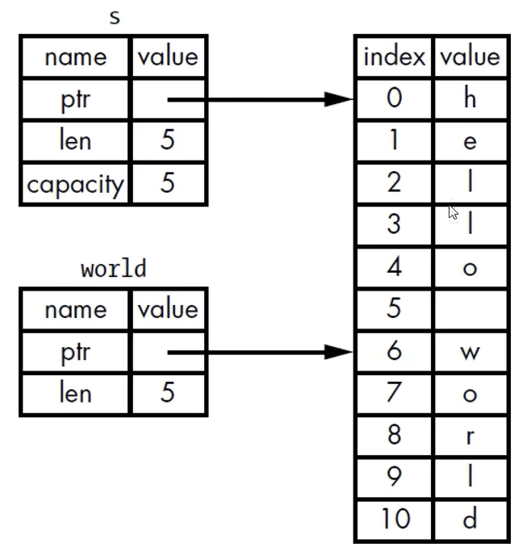

# PART1. 切片

Rust的另外一种不持有所有权的数据类型: 切片(slice).切片是对一个数组的引用,它包含了数组的地址和长度.切片的类型是`&[T]`,其中`T`是切片的元素类型

# PART2. 字符串切片的应用场景

设计一个函数,该函数接收一个字符串参数,并返回该字符串中的第一个单词(以空格分隔).如果该字符串中没有空格,则返回整个字符串.

```rust
fn main() {
    let s = String::from("hello world");
    let index = word_index(&s);
    println!("index: {}", index);
}

fn word_index(s: &String) -> usize {
    let bytes = s.as_bytes();

    // step1. bytes.iter(): 该方法的返回值类型是一个迭代器
    // step2. enumerate(): 该方法的返回值类型是一个元组.元组的第一个元素是索引,第二个元素是引用(这个引用是不可变的)
    for (i, &item) in bytes.iter().enumerate() {
        if item == b' ' {
            return i;
        }
    }
    s.len()
}
```

```bash
cargo run
   Compiling word_index v0.1.0 (/word_index)
    Finished `dev` profile [unoptimized + debuginfo] target(s) in 5.44s
     Running `target/debug/word_index`
index: 5
```

这个设计是有缺陷的:如果在获取空格的索引之后,原字符串发生了改变,那么这个索引就不正确了:

```rust
fn main() {
    let mut s = String::from("hello world");
    let index = word_index(&s);

    // 获取索引后修改字符串
    s.clear();

    println!("index: {}", index);
    println!("s: {}", s);
}

fn word_index(s: &String) -> usize {
    let bytes = s.as_bytes();

    // step1. bytes.iter(): 该方法的返回值类型是一个迭代器
    // step2. enumerate(): 该方法的返回值类型是一个元组.元组的第一个元素是索引,第二个元素是引用(这个引用是不可变的)
    for (i, &item) in bytes.iter().enumerate() {
        if item == b' ' {
            return i;
        }
    }
    s.len()
}
```

```bash
cargo run
   Compiling word_index v0.1.0 (/word_index)
    Finished `dev` profile [unoptimized + debuginfo] target(s) in 0.30s
     Running `target/debug/word_index`
index: 5
s: 
```

核心点在于:我们找到的索引和原字符串之间,没有任何关联.

# PART3. 字符串切片

字符串切片:指向字符串中一部分内容的**不可变引用**(注意字符串切片的本质是不可变引用,这就意味着你不能通过字符串切片来修改原字符串的内容)

```rust
fn main() {
    let s = String::from("hello world");

    // &s[0..5] 左闭右开区间 [0, 5) 即 h e l l o
    let hello: &str = &s[0..5];
    let world: &str = &s[6..11];

    // 语法糖: 从0开始可以省略0
    let same_hello: &str = &s[..5];

    // 语法糖: 到结尾可以省略结尾
    let same_world: &str = &s[6..];

    // 语法糖: 从0开始到结尾可以省略两端
    let hello_world: &str = &s[..];
}
```



Tips:图片中s的len和capacity应该是11,而不是5.图画错了.

Tips:左侧2个方框是在Stack上的,右侧的方框是在Heap上的.

## 3.1 字符串切片的注意事项

- 字符串切片的范围索引必须发生在有效的UTF-8字符边界内
- 如果尝试从一个多字节的字符中创建字符串切片,程序会发生panic

例:

```rust
fn main() {
    let s = String::from("这是中文字符串");
    let slice1: &str = &s[0..2];
    println!("{}", slice1);

    let slice2: &str = &s[0..3];
    println!("{}", slice2);
}
```

```bash
 cargo run
   Compiling not_utf8_char v0.1.0 (/not_utf8_char)
    Finished `dev` profile [unoptimized + debuginfo] target(s) in 0.58s
     Running `target/debug/not_utf8_char`
thread 'main' panicked at src/main.rs:3:26:
byte index 2 is not a char boundary; it is inside '这' (bytes 0..3) of `这是中文字符串`
note: run with `RUST_BACKTRACE=1` environment variable to display a backtrace
```

汉字的一个字符占3个字节,所以`&s[0..2]`是不合法的.

```rust
fn main() {
    let s = String::from("这是中文字符串");
    // let slice1: &str = &s[0..2];
    // println!("{}", slice1);

    let slice2: &str = &s[0..3];
    println!("{}", slice2);
}
```

```bash
cargo run
   Compiling not_utf8_char v0.1.0 (/not_utf8_char)
    Finished `dev` profile [unoptimized + debuginfo] target(s) in 0.26s
     Running `target/debug/not_utf8_char`
这
```

Tips:通常如果需要将中文字符串转换为切片,会直接取原字符串的所有字符作为字符串切片,而不是指定索引范围

例:

```rust
fn main() {
    let s = String::from("这是中文字符串");
    // let slice1: &str = &s[0..2];
    // println!("{}", slice1);

    // let slice2: &str = &s[0..3];
    // println!("{}", slice2);

    let slice3: &str = &s[..];
    for c in slice3.chars() {
        println!("{}", c);
    }
}
```

```bash
cargo run
   Compiling not_utf8_char v0.1.0 (/not_utf8_char)
    Finished `dev` profile [unoptimized + debuginfo] target(s) in 0.29s
     Running `target/debug/not_utf8_char`
这
是
中
文
字
符
串
```

## 3.2 使用字符串切片重构函数

```rust
fn main() {
    let s = String::from("hello world");
    let index = word_index(&s);

    // 获取索引后修改字符串
    // 注意: &s是一个不可变引用,而s.clear()需要一个可变引用
    // 这违反了借用规则: 在特定作用域中,要么只能有一个可变引用,要么只能有多个不可变引用
    // 这样,我们找到的索引就和字符串产生了关联,确保了我们不会在索引之后修改字符串
    // s.clear(); // error[E0502]: cannot borrow `s` as mutable because it is also borrowed as immutable

    println!("index: {}", index);
    println!("s: {}", s);
}

fn word_index(s: &String) -> &str {
    let bytes = s.as_bytes();
    for (i, &item) in bytes.iter().enumerate() {
        if item == b' ' {
            return &s[..i];
        }
    }
    &s[..]
}
```

```bash
cargo run
   Compiling word_index_str_slice v0.1.0 (/word_index_str_slice)
    Finished `dev` profile [unoptimized + debuginfo] target(s) in 0.93s
     Running `target/debug/word_index_str_slice`
index: hello
s: hello world
```

## 3.3 字符串字面值

字符串字面值是一个切片,它的类型是`&str`.字符串字面值是不可变的,并且存储在二进制文件的只读内存区域中.

```rust
fn main() {
    let s: &str = "hello world";
}
```

因为字符串切片是**不可变引用**,所以字符串字面量也是不可变的

## 3.4 将字符串切片作为参数传递

我们之前设计的函数,其签名为`fn word_index(s: &String) -> &str`.而有经验的Rust程序员会将其改为`fn word_index(s: &str) -> &str`.

因为这样可以同时接收String和&str类型的参数,而不需要将String类型的参数转换为&str类型的参数.

- 使用&str类型,则可以直接调用
- 使用String类型,则需要在调用前创建一个完整的String切片即可

```rust
fn main() {
    // 使用String类型 在调用前创建一个完整的String切片调用即可
    let s1 = String::from("hello world");
    let index1 = word_index(&s1[..]);
    println!("index1: {}", index1);
    println!("s1: {}", s1);

    // 使用&str类型 直接调用即可
    let s2 = "fuck world";
    let index2 = word_index(s2);
    println!("index2: {}", index2);
    println!("s2: {}", s2);
}

fn word_index(s: &str) -> &str {
    let bytes = s.as_bytes();
    for (i, &item) in bytes.iter().enumerate() {
        if item == b' ' {
            return &s[..i];
        }
    }
    &s[..]
}
```

**定义函数时,使用字符串切片来代替字符串引用会使API更加通用,且不会损失任何功能**

# PART4. 其他类型的切片

```rust
fn main() {
    let a = [1, 2, 3, 4, 5];
    let slice: &[i32] = &a[0..2];
}
```
