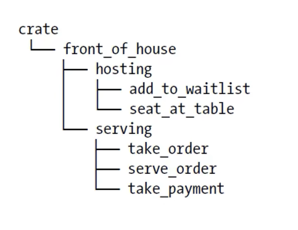

# PART1. Rust的代码组织

代码组织主要包括:

- 哪些细节可以暴露,那些细节应该隐藏
- 作用域内哪些名称有效

这些功能统称为模块系统:

- Package(包): Cargo的一个功能,允许你构建、测试和分享crate
- Crate(单元包): 一个模块树,它可以产生一个library或可执行文件
- Module(模块)和use: 让你控制代码的组织、作用域、私有路径
- Path(路径): 为struct、function或module等命名的方式

# PART2. Package和Crate

Crate有2种类型:

- binary
- library

Crate Root:

- Crate Root是源代码文件
- Crate Root是入口文件,Rust编译器从这里开始,组成你的Crate的模块树(根Module)

一个Package:

- 包含1个`Cargo.toml`,描述如何构建这些Crates
- 只能包含0-1个library Crate
- 可以包含任意数量的binary Crate
- 必须至少包含1个crate(可以是binary或library)

# PART3. 例子

- 创建Package

```bash
cargo new my_package
    Creating binary (application) `my_package` package
note: see more `Cargo.toml` keys and their definitions at https://doc.rust-lang.org/cargo/reference/manifest.html
```

Creating binary (application) `my_package` package: 创建了一个binary Crate

```
tree ./
./
├── Cargo.toml  // 配置文件
└── src
    └── main.rs // 入口文件

1 directory, 2 files
```

## 3.1 Cargo的惯例

- `src/main.rs`是binary Crate的Crate Root
- Crate名与包名相同,即`my_package`

- `src/lib.rs`是library Crate的Crate Root
- Crate名与包名相同,即`my_package`

Cargo将Crate Root文件交给rustc来构建library或binary

- library Crate:这种类型的crate会被编译为一个库文件(.rlib或.so).这些库文件可以被其他Rust程序或库引用和使用.Library crate的主要目的是为了重用代码.在一个library crate中,通常会定义一些函数、结构体、枚举、trait等，这些可以被其他crate使用.在Rust的package中,`src/lib.rs`文件是library crate的根(root)
- binary Crate:这种类型的crate会被编译为一个可执行文件.这些可执行文件可以直接运行.在一个binary crate中,通常会定义一个main函数.在Rust的package中,`src/main.rs`文件是binary crate的根(root)

- 一个Package可以同时包含`src/main.rs`和`src/lib.rs`,这就意味着这个Package包含了一个library Crate和一个binary Crate,这两个Crate的名称都是Package的名称
- 一个Package可以有多个binary crate:
  - 文件放在`src/bin`目录下
  - 每个文件都是一个独立的binary crate

# PART4. Crate的作用

- 将相关功能组合到一个作用域内,便于在项目间进行分享,同时也可以防止命名冲突

# PART5. Module

Module:

- 在1个crate内,将代码进行分组
- 增加可读性,易于复用
- 控制语法项(item)的私有性

## 5.1 建立Module

- 使用`mod`关键字建立Module
- Module是可以嵌套的
- Module中可以包含其他项(struct、enum、常量、trait、函数等)的定义

下面举一个例子,让我们编写一个提供就餐服务的库单元包.为了将注意力集中到代码组织而不是实现细节上,这个示例只会定义函数的签名而省略函数体中的具体内容.

在餐饮业中,店面往往会被划分为前厅与后厨两个部分.其中,前厅会被用于服务客户、处理订单、结账及调酒,而后厨则主要用于厨师与职工们制作料理,以及进行其他一些管理工作.

创建一个新的**库单元包**:

```bash
cargo new --lib restaurant
    Creating library `restaurant` package
note: see more `Cargo.toml` keys and their definitions at https://doc.rust-lang.org/cargo/reference/manifest.html
```

```bash
tree ./
./
├── Cargo.toml
└── src
    └── lib.rs

1 directory, 2 files
```

在`src/lib.rs`中定义Module:

```rust
// mod 模块名 定义Module
mod front_of_house {
    // 子Module
    mod hosting {
        fn add_to_waitlist() {}
        fn seat_at_table() {}
    }

    // 子Module
    mod serving {
        fn take_order() {}
        fn serve_order() {}
        fn take_payment() {}
    }
}
```



```bash
tree ./
./
├── Cargo.toml
└── src
    └── lib.rs

1 directory, 2 files
```

`src/lib.rs`或`src/main.rs`,这两个文件(任意一个)的内容都形成了名为crate的根Module,位于整个模块树的根部.

本例中,图中的crate即指代`src/lib.rs`.图中的crate是一个隐式根模块

注:`restaurant`执行`cargo build`的编译结果为一个`.rlib`文件,这是一个库文件,可以被其他Rust程序或库引用和使用
